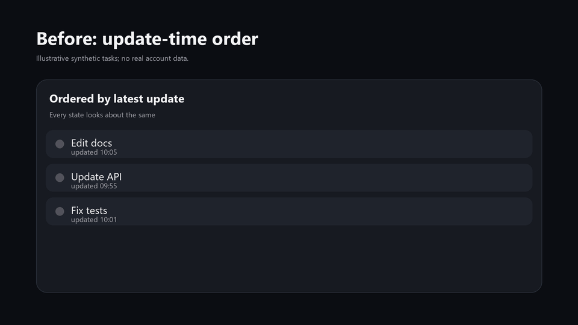

# codex-desktop-workflow

[](https://github.com/catterhu1207-ux/codex-desktop-workflow/actions/workflows/tests.yml)
[](https://github.com/catterhu1207-ux/codex-desktop-workflow/releases/latest)
[](LICENSE)
[Landing page](https://catterhu1207-ux.github.io/codex-desktop-workflow/)

**Make Codex Desktop easier to scan, prioritize, and resume when you run many tasks in parallel.**



## Install in one command

```powershell
irm https://github.com/catterhu1207-ux/codex-desktop-workflow/releases/latest/download/install.ps1 | iex
```

The installer finds your official Codex Desktop package, builds an independent copy, verifies two isolated launches, and leaves the official app untouched.

- **Start-time ordering** — initial loading and live updates use the same task/process recency rule.
- **Attention colors** — yellow means a real pending plan, red means pinned attention, and blue means ordinary unread.
- **Readable remote names** — sidebar, search, Work picker, tooltips, and accessibility text stop exposing project UUIDs.
- **Per-task settings preserved** — existing tasks keep valid model and reasoning settings; the global default applies to new tasks.

> Unofficial project. Not affiliated with OpenAI. It does not provide, download, or redistribute official binaries, and it does not replace the official app.

When several Codex tasks are active at once, the hard part is often not execution. It is knowing **what needs attention next, which task is waiting for implementation, which one you pinned, which remote project you are looking at, and whether changing a global model default will disturb an existing task.**

`codex-desktop-workflow` is a Windows-focused local build tool. You supply your own supported official Codex application directory. It creates an independent modified copy, validates the exact supported build and key UI entry points, then performs isolated launch verification against the generated artifact.

> It does not provide, download, or redistribute official binaries. You must supply your own supported official Codex installation.

[中文说明](README.zh-CN.md)

See [FAQ](docs/FAQ.md), [Troubleshooting](docs/TROUBLESHOOTING.md), and the redacted [acceptance report](ACCEPTANCE.md) for install details, failure handling, and verification evidence.

## The problem in 30 seconds

| Codex Desktop pain point | Modified behavior |
|---|---|
| Priority order does not match what you should look at next | Sort by actual task or process start-time recency, with the same rule for initial loading and live updates |
| Status dots do not communicate the next action | **Yellow** = pending implementation, **red** = pinned attention, **blue** = ordinary unread; yellow wins when planned and pinned |
| Remote projects expose internal IDs | Sidebar, search, Work picker, prompts, and accessibility text show a recognizable project name while preserving routing identity |
| A global model default can disturb parallel-task context | Existing tasks keep valid model and reasoning settings; the global default applies only to new tasks |

### Before / After: ordering and attention states

**Start times determine ordering; colors communicate attention states.** The sort does not use AI to rank task importance, nor does it place every task of one color ahead of all others.

The following three fictional tasks belong to the same sorting group. They illustrate the difference between update-time and actual-start-time ordering, not a claim about the default behavior of every official release.

| Example task | Actual start | Last update |
|---|---|---|
| Edit docs | 09:10 | 10:05 |
| Update API | 09:50 | 09:55 |
| Fix tests | 10:00 | 10:01 |

```text
By latest update                 Modified: by actual start
────────────────────────         ─────────────────────────
Edit docs   updated 10:05         Fix tests   started 10:00
Fix tests   updated 10:01         Update API  started 09:50
Update API  updated 09:55         Edit docs   started 09:10
```

Initial loading and live updates use the same ordering rule. Separately, **yellow means pending implementation, red means pinned attention, and blue means ordinary unread**. Yellow takes precedence when planned and pinned states coexist; loading keeps its spinner.

Remote projects also show recognizable names rather than internal IDs. Existing tasks retain valid model and reasoning settings, while the global default applies only to new tasks. Preserving settings does not itself add model support or task-history migration.

If you normally keep only one or two tasks open, you probably do not need this project.

If you routinely manage many Codex tasks and already rely on memory, repeated opening, or guesswork to decide where to look next, this is the workflow this project is designed around.

## More than a one-off patch script

The project turns post-update adaptation into a repeatable, verifiable process:

1. **inspect** — validate the supported version, full ASAR, backend, and key entry-point hashes.
2. **build** — generate a fresh modified copy from a clean official directory without overwriting the source.
3. **verify** — run real component checks and two isolated launch validations.
4. **import-data / launch / status / stop** — continue your own task data in a separate copy and manage that run explicitly.

Unknown versions, hash mismatches, ambiguous patch matches, failed contracts, or missing runtime evidence stop the workflow instead of silently producing a best-effort build.

## Current support

Version `v0.2.3` supports Windows x64 with the official bundled `codex.exe`:

- Codex Desktop `26.917.6896.0`
  - Official `app.asar`: `00b7936388d11a3faede5fc736a8c6264eb66e1907bac4ef72c39b7399175d68`
  - Official `codex.exe`: `97d4d67419d0ac2f71342f9a5e850f9468aa622618de8ea823223edb9a91926a`
- Codex Desktop `26.915.4065.0`
  - Official `app.asar`: `b8aeb817cd1ee6ef50efe8a97985d3be41de89688a5addfe0a444e1e52348096`
  - Official `codex.exe`: `bc45017e8239dc150258f69309ced9df6bbcdf5b8e4f346decf780ac0999e226`
- Codex Desktop `26.915.3509.0`
  - Official `app.asar` identity: `8227f6234cf2cc418ec8bbdeedec03f8d777f85520929ff2d9d38e774f681dfd`
  - Official `codex.exe` identity: `ff9bc3ddc08fa52b43ea170be5f628ffad1c1d9c80c5770b8e2a2f817a9ee3c9`
- Codex Desktop `26.908.9136.0`
  - Official `app.asar` identity: `7a46bd6fe162050afbac27d7d5271d19524e887fa0cdd06c0f2d3fa9b606a31d`
  - Existing `v0.1.0` isolated-renderer acceptance evidence remains applicable

A matching version number with different bytes is rejected.

See [COMPATIBILITY.md](COMPATIBILITY.md) for the full support matrix.

The cross-provider Responses compatibility patch is published separately in [codex-history-compat](https://github.com/catterhu1207-ux/codex-history-compat), but that desktop combination has not completed independent qualification in this repository and is therefore not marked as supported in `v0.2.3`.

An optional [read-only channel preview and Responses diagnostic example](examples/channel-preview/README.md) is available for checking a provider before changing any settings. It does not install a channel switcher or migrate existing tasks.

## Manual install and development

Requirements:

- Python 3.10+
- Git
- Your own supported official Codex application directory

Assume the official package is located at:

```text
C:\official\OpenAI.Codex_26.917.6896.0_x64__2p2nqsd0c76g0
```

Install:

```powershell
git clone https://github.com/catterhu1207-ux/codex-desktop-workflow.git
cd codex-desktop-workflow
py -3 -m venv .venv
.\.venv\Scripts\python.exe -m pip install -e .
```

### 1. Inspect the official package

```powershell
.\.venv\Scripts\codex-desktop-workflow.exe inspect `
  --source C:\official\OpenAI.Codex_26.917.6896.0_x64__2p2nqsd0c76g0
```

### 2. Build an independent modified copy

The target directory must not already exist:

```powershell
.\.venv\Scripts\codex-desktop-workflow.exe build `
  --source C:\official\OpenAI.Codex_26.917.6896.0_x64__2p2nqsd0c76g0 `
  --target C:\codex-workflow\app
```

### 3. Verify real components and startup behavior

```powershell
.\.venv\Scripts\codex-desktop-workflow.exe verify `
  --source C:\official\OpenAI.Codex_26.917.6896.0_x64__2p2nqsd0c76g0 `
  --portable C:\codex-workflow\app `
  --runs-root C:\codex-workflow\verification
```

The same commands work with the retained `26.908.9136.0` profile when that exact package is supplied.

`verify` requires two launches with the matching packaged `codex.exe` backend, a fresh renderer proof, at least 60 seconds of observation, and a clean normal exit. It never force-terminates user processes.

Isolated acceptance does not copy authentication. In the signed-out environment, the tool briefly mounts the real task renderer to produce proof bound to the current artifact; the UI may then return to sign-in.

See the redacted two-run result in [ACCEPTANCE.md](ACCEPTANCE.md).

## Import an independent copy of existing tasks

Exit every Codex / ChatGPT desktop and backend process first, then create a separate task-data copy:

```powershell
codex-desktop-workflow import-data `
  --source C:\Users\you\.codex `
  --target C:\codex-workflow\data

codex-desktop-workflow launch `
  --portable C:\codex-workflow\app `
  --data C:\codex-workflow\data `
  --runs-root C:\codex-workflow\daily-runs
```

The import uses SQLite-consistent backups and copies task-record directories.

It excludes:

- `auth.json`
- `config.toml`
- plugins
- skills
- authentication material

Sign in or configure services again inside the independent environment. The official and modified data sets are not automatically synchronized or merged.

Use the returned run directory with `status` and `stop`:

```powershell
codex-desktop-workflow status --run C:\codex-workflow\daily-runs\run-<id>
codex-desktop-workflow stop --run C:\codex-workflow\daily-runs\run-<id>
```

`stop` uses the supported app's own quit action through its local debugging port, then checks the registered main and backend processes again. Identity mismatches and timeouts are reported as blocked; processes are not force-terminated.

## Safety boundaries

- Every build writes to a new target directory; source/target nesting and repeat patching are rejected.
- Unknown versions, hash mismatches, ambiguous transformations, failed contracts, or missing runtime evidence stop the workflow.
- Generated reports contain user-selected local paths; inspect them before sharing.
- Reports do not record task bodies, credentials, or tokens.
- The project does not provide, download, or redistribute official Codex binaries.
- This is an unofficial experimental community project. It is not endorsed by OpenAI and does not replace official updates or support.

## Project family

This repository is the practical entry point.

Generic source staging and process management are pinned to [electron-update-safety v0.1.3](https://github.com/catterhu1207-ux/electron-update-safety/releases/tag/v0.1.3).

Lifecycle evidence stages come from [desktop-adaptation-lab v0.1.0](https://github.com/catterhu1207-ux/desktop-adaptation-lab/releases/tag/v0.1.0).

Cross-provider Responses history compatibility experiments live in [codex-history-compat](https://github.com/catterhu1207-ux/codex-history-compat).

## Documentation

- [ACCEPTANCE.md](ACCEPTANCE.md) — redacted acceptance evidence
- [COMPATIBILITY.md](COMPATIBILITY.md) — supported versions and hashes
- [RELEASE_NOTES.md](RELEASE_NOTES.md) — release notes
- [SOURCE_INVENTORY.md](SOURCE_INVENTORY.md) — source inventory
- [SECURITY.md](SECURITY.md) — security notes
- [CONTRIBUTING.md](CONTRIBUTING.md) — contribution guide

## Good issues to file

Reproducible reports are especially useful for:

- a new Codex Desktop release that needs re-adaptation
- a UI entry point that does not receive the expected behavior
- `inspect`, `build`, or `verify` failures on an otherwise supported build
- additional concrete attention-management pain points in multi-task Codex workflows

Please do not upload authentication files, task content, access tokens, or unauthorized copies of official binaries to Issues.

---

**One-line positioning:** this is not another Codex client. It is a local, verifiable adaptation layer that makes the official Codex Desktop workflow easier to prioritize when many tasks are running at once.
