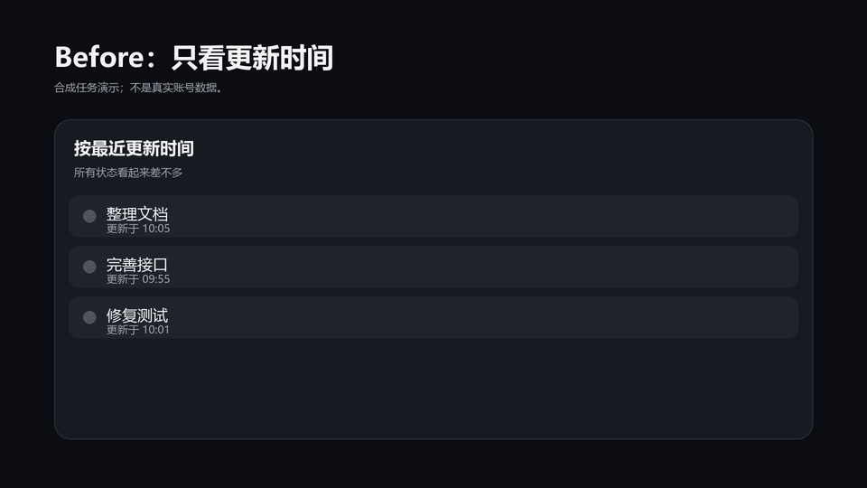

# codex-desktop-workflow

[](https://github.com/catterhu1207-ux/codex-desktop-workflow/actions/workflows/tests.yml)
[](https://github.com/catterhu1207-ux/codex-desktop-workflow/releases/latest)
[](LICENSE)
[项目主页](https://catterhu1207-ux.github.io/codex-desktop-workflow/)

**让 Codex Desktop 在多任务并行时更容易看懂、排序和继续工作。**



## 一条命令安装

```powershell
irm https://github.com/catterhu1207-ux/codex-desktop-workflow/releases/latest/download/install.ps1 | iex
```

安装器会找到你自己的官方 Codex Desktop 包，生成独立副本，执行两轮隔离启动验证，并保持官方应用不变。

- **按实际开始时间排序**：初次加载和实时更新使用同一任务/进程时间规则。
- **状态颜色**：黄色表示真实待实施计划，红色表示置顶关注，蓝色表示普通未读。
- **远程项目可读名称**：侧栏、搜索、Work 选择器、悬浮提示和无障碍文本不再直接暴露项目 UUID。
- **保留每个任务的设置**：已有任务保留有效的模型和推理设置；全局默认只用于新任务。

> 非官方项目，与 OpenAI 无隶属关系。不提供、不下载、不重新分发官方二进制，也不替换官方应用。

当你同时跑很多 Codex 任务时，真正的问题往往在于排序和提示是否清楚，而不是执行本身：**下一步该看哪个？哪个在等你确认计划？哪个只是普通未读？远程项目到底是哪一个？切换全局模型会不会把已有任务的上下文弄乱？**

`codex-desktop-workflow` 是一个面向 Windows 的本地生成工具。它读取你自己已经取得的、受支持的官方 Codex 应用目录，在新目录中生成独立的实验性修改版，并对版本、完整性、关键界面入口和真实启动结果进行校验。

> 不提供、不下载、不重新分发官方二进制。你必须自行提供受支持的官方 Codex 安装目录。

[English README](README.md)

安装细节、失败处理和验收证据见 [FAQ](docs/FAQ.zh-CN.md)、[故障排查](docs/TROUBLESHOOTING.md) 和脱敏的 [验收记录](ACCEPTANCE.md)。

## 30 秒看懂它解决什么

| Codex Desktop 中的痛点 | 生成后的行为 |
|---|---|
| Priority 顺序不等于“我现在最该看什么” | 按任务或进程实际开始时间排序，初次加载和实时更新使用同一规则 |
| 所有提示点看起来差不多 | **黄色** = 待实施计划，**红色** = 置顶关注，**蓝色** = 普通未读；计划与置顶同时存在时黄色优先 |
| Remote 项目显示内部 ID，不容易识别 | 侧栏、搜索、Work 选择器、提示与辅助文本显示可识别名称，同时保留原路由身份 |
| 修改全局默认模型会影响正在并行处理的任务 | 已有任务保留其有效模型和推理设置；全局默认只用于新任务 |

### Before / After：排序与状态分别解决什么？

**排序看开始时间，状态看提示颜色。** 这里的排序不是 AI 判断任务重要性，也不是把某一种颜色的任务一律排到最前。

下面用同一排序分组内的三个虚构任务，说明“按更新时间”和“按实际开始时间”的区别。它不是对所有官方版本默认排序的断言。

| 示例任务 | 实际开始时间 | 最近更新时间 |
|---|---|---|
| 整理文档 | 09:10 | 10:05 |
| 完善接口 | 09:50 | 09:55 |
| 修复测试 | 10:00 | 10:01 |

```text
按最近更新时间                 修改后：按实际开始时间
──────────────────             ──────────────────────
整理文档  更新于 10:05          修复测试  开始于 10:00
修复测试  更新于 10:01          完善接口  开始于 09:50
完善接口  更新于 09:55          整理文档  开始于 09:10
```

初次加载与实时更新使用同一排序规则。颜色则用于区分下一步动作：**黄色表示待实施计划，红色表示置顶关注，蓝色表示普通未读**；计划与置顶同时存在时黄色优先，加载状态继续显示转圈。

另外，远程项目显示可识别名称而不是内部 ID；已有任务保留有效的模型和推理设置，全局默认只用于新任务。这里的“保留设置”不等于新增模型支持或任务历史迁移功能。

如果你通常只开 1–2 个任务，这个项目可能没有必要。

如果你经常同时处理很多 Codex 任务，并且已经开始靠“记忆”“反复点开”“猜哪个更重要”来管理注意力，这个项目就是为这个场景做的。

## 它不是简单的手工改包脚本

项目把“每次官方更新后重新适配”做成了一套可核验流程：

1. **inspect**：核对支持版本、完整 ASAR、后端和关键入口摘要。
2. **build**：只从干净官方目录生成一个全新副本，不覆盖源目录。
3. **verify**：运行真实组件检查，并执行两次隔离启动验证。
4. **import-data / launch / status / stop**：在独立数据副本中继续自己的任务，并对运行实例进行显式管理。

未知版本、摘要不符、补丁匹配不唯一、功能契约失败或运行证明缺失都会停止，而不是“尽量改完再说”。

## 当前支持范围

`v0.2.4` 支持 Windows x64，并使用官方包内的 `codex.exe`：

- Codex Desktop `26.917.9434.0`
  - 官方 `app.asar`：`d4234b03eb532fe0f3e9a7d90caad51edb68af45f771cc786d966377e7446f5a`
  - 官方 `codex.exe`：`9015c47d1714294ecd9033c4b5aefc3076797d867d1c36aa37749fcb76c8942f`
- Codex Desktop `26.917.6896.0`
  - 官方 `app.asar`：`00b7936388d11a3faede5fc736a8c6264eb66e1907bac4ef72c39b7399175d68`
  - 官方 `codex.exe`：`97d4d67419d0ac2f71342f9a5e850f9468aa622618de8ea823223edb9a91926a`
- Codex Desktop `26.915.4065.0`
  - 官方 `app.asar`：`b8aeb817cd1ee6ef50efe8a97985d3be41de89688a5addfe0a444e1e52348096`
  - 官方 `codex.exe`：`bc45017e8239dc150258f69309ced9df6bbcdf5b8e4f346decf780ac0999e226`
- Codex Desktop `26.915.3509.0`
  - 官方 `app.asar` 标识：`8227f6234cf2cc418ec8bbdeedec03f8d777f85520929ff2d9d38e774f681dfd`
  - 官方 `codex.exe` 标识：`ff9bc3ddc08fa52b43ea170be5f628ffad1c1d9c80c5770b8e2a2f817a9ee3c9`
- Codex Desktop `26.908.9136.0`
  - 官方 `app.asar` 标识：`7a46bd6fe162050afbac27d7d5271d19524e887fa0cdd06c0f2d3fa9b606a31d`
  - 既有 `v0.1.0` 隔离启动验收记录继续适用

版本号相同但文件不匹配也会拒绝。

完整支持矩阵见 [COMPATIBILITY.md](COMPATIBILITY.md)。

第三方 Responses 兼容服务的后端修复在 [codex-history-compat](https://github.com/catterhu1207-ux/codex-history-compat) 中公开，但尚未作为本仓库的桌面组合完成独立验收，因此 `v0.2.4` 不把它标为可用组合。

## 手动安装与开发

需要：

- Python 3.10+
- Git
- 你自己取得的受支持官方 Codex 应用目录

下面假设官方包根目录为：

```text
C:\official\OpenAI.Codex_26.917.9434.0_x64__2p2nqsd0c76g0
```

安装：

```powershell
git clone https://github.com/catterhu1207-ux/codex-desktop-workflow.git
cd codex-desktop-workflow
py -3 -m venv .venv
.\.venv\Scripts\python.exe -m pip install -e .
```

### 1. 检查官方包是否为支持版本

```powershell
.\.venv\Scripts\codex-desktop-workflow.exe inspect `
  --source C:\official\OpenAI.Codex_26.917.9434.0_x64__2p2nqsd0c76g0
```

### 2. 生成独立修改版

目标目录必须不存在：

```powershell
.\.venv\Scripts\codex-desktop-workflow.exe build `
  --source C:\official\OpenAI.Codex_26.917.9434.0_x64__2p2nqsd0c76g0 `
  --target C:\codex-workflow\app
```

### 3. 验证真实组件和启动结果

```powershell
.\.venv\Scripts\codex-desktop-workflow.exe verify `
  --source C:\official\OpenAI.Codex_26.917.9434.0_x64__2p2nqsd0c76g0 `
  --portable C:\codex-workflow\app `
  --runs-root C:\codex-workflow\verification
```

`verify` 要求两次启动分别出现公共工件自身的 `codex.exe` 后端、真实 renderer 证明和正常退出。任意一次超时、后台残留或证明不匹配都会失败。它不会强行终止用户进程。保留的 `26.908.9136.0` profile 在提供对应官方包时使用相同命令。

隔离验收不复制认证。工具会在未登录的独立环境中短暂挂载真实任务界面以生成与本次产物绑定的 renderer 证明，随后界面可能回到登录页。

公开的两轮脱敏结果见 [ACCEPTANCE.md](ACCEPTANCE.md)。

## 导入自己的任务副本

隔离验收使用全新数据。

如果需要在修改版中继续自己的任务，请先完全退出所有 Codex / ChatGPT 桌面进程和后端，再显式创建独立数据副本：

```powershell
.\.venv\Scripts\codex-desktop-workflow.exe import-data `
  --source C:\Users\you\.codex `
  --target C:\codex-workflow\data

.\.venv\Scripts\codex-desktop-workflow.exe launch `
  --portable C:\codex-workflow\app `
  --data C:\codex-workflow\data `
  --runs-root C:\codex-workflow\daily-runs
```

导入使用 SQLite 一致性备份并复制任务记录目录。

它**不会复制**：

- `auth.json`
- `config.toml`
- 插件
- 技能
- 认证信息

首次启动后请在独立环境重新登录或配置服务。官方数据与修改版数据之后各自保存，不自动同步或合并。

`launch` 会输出运行目录。用同一个目录查看状态或正常关闭：

```powershell
codex-desktop-workflow status --run C:\codex-workflow\daily-runs\run-<id>
codex-desktop-workflow stop --run C:\codex-workflow\daily-runs\run-<id>
```

`stop` 通过本地调试端口调用该版本应用自身的退出动作，并再次核对主进程与已登记后端。身份不符或超时会报告阻塞，不会强制结束进程。

## 安全边界

- 所有构建都写入不存在的新目录，拒绝源目标嵌套和重复补丁。
- 未知版本、摘要不符、补丁匹配不唯一、功能契约失败或运行证明缺失都会停止。
- 生成报告会记录你选择的位置；分享前请自行检查。
- 报告不记录任务正文、凭据或令牌。
- 项目不提供、不下载、不重新分发官方 Codex 二进制。
- 本项目是非官方实验性社区工具，不代表 OpenAI，也不替代官方更新和支持。

## 项目组成

这个仓库是实际使用入口。

通用来源暂存与进程管理固定使用 [electron-update-safety v0.1.3](https://github.com/catterhu1207-ux/electron-update-safety/releases/tag/v0.1.3)。

证据阶段来自 [desktop-adaptation-lab v0.1.0](https://github.com/catterhu1207-ux/desktop-adaptation-lab/releases/tag/v0.1.0)。

第三方 Responses 历史兼容相关实验位于 [codex-history-compat](https://github.com/catterhu1207-ux/codex-history-compat)。

## 文档

- [ACCEPTANCE.md](ACCEPTANCE.md) — 脱敏验收结果
- [COMPATIBILITY.md](COMPATIBILITY.md) — 支持版本和摘要矩阵
- [RELEASE_NOTES.md](RELEASE_NOTES.md) — 版本说明
- [SOURCE_INVENTORY.md](SOURCE_INVENTORY.md) — 来源清单
- [SECURITY.md](SECURITY.md) — 安全说明
- [CONTRIBUTING.md](CONTRIBUTING.md) — 贡献说明

## 适合提交什么 Issue？

欢迎提交可复现的问题，尤其是：

- 新 Codex Desktop 版本需要重新适配
- 某个界面入口没有应用预期行为
- `inspect` / `build` / `verify` 在支持版本上出现异常
- 多任务工作流中还有明确、可复现的注意力管理痛点

请不要在 Issue 中上传认证文件、任务正文、访问令牌或未经授权分发的官方二进制。

---

**一句话定位：** 这不是另一个 Codex 客户端，而是一套把官方 Codex Desktop 的多任务工作流改成“更容易判断下一步做什么”的本地、可验证适配工具。
